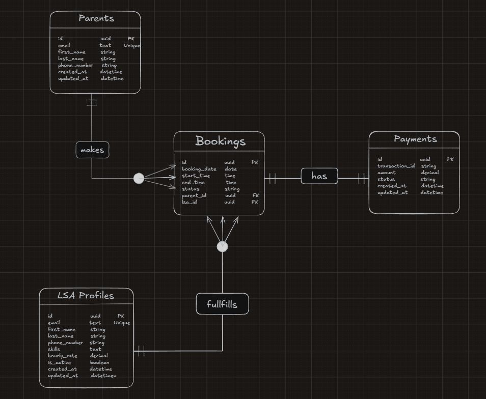

# HABOT LSA Booking System Backend

**Author / Candidate:** Savyez  
**Contact Email:** visnuk252@gmail.com  
**Repository:** [https://github.com/savyez/LSA-Booking](https://github.com/savyez/LSA-Booking)  

---

A robust, enterprise-grade Django REST Framework (DRF) backend microservice designed to connect Parents with **Learning Support Assistants (LSAs)**. It features concurrency-safe session scheduling, double-booking prevention, multi-hour billing, normalized skill searching, payment gateway integration, modular settings environment separation, and automated CI/CD.

---

## 📖 Documentation & Diagram Links
- 🔌 **[APIs.md - REST API Specification](APIs.md)**: Exhaustive documentation of all REST endpoints, request payloads, response schemas, and status codes.
- 🗺️ **[ER Diagram](ER-Diagram.png)**: Visual database schema diagram showing model relationships.
- ⚙️ **[CI/CD Workflow](.github/workflows/test.yml)**: GitHub Actions continuous integration pipeline configuration.

---

## 🗺️ Database Schema (ER Diagram)



---

## 📁 Modular Settings Package Structure

The Django configuration has been separated into a modular settings package (`config/settings/`):

```text
config/
├── settings/
│   ├── __init__.py      # Environment selector (loads local.py or production.py based on DJANGO_ENV)
│   ├── base.py          # Shared base settings (installed apps, middleware, REST framework, i18n)
│   ├── local.py         # Local development configuration (DEBUG=True, localhost DB/hosts)
│   └── production.py    # Production configuration (DEBUG=False, strict security headers)
├── urls.py              # Root API URL routing (/api/v1/)
├── wsgi.py              # WSGI entrypoint
└── asgi.py              # ASGI entrypoint
```

### Settings Import & Resolution
All application code accesses runtime configuration using Django's standard dynamic configuration proxy:
```python
from django.conf import settings
```
Entrypoints (`manage.py`, `wsgi.py`, `asgi.py`) set `DJANGO_SETTINGS_MODULE='config.settings'`, delegating setting imports to [`config/settings/__init__.py`](config/settings/__init__.py) which dynamically selects `local` or `production` based on the `DJANGO_ENV` environment variable.

---

## 🚀 Quick Setup & Installation Instructions

### Prerequisites
- **Python**: `3.12`
- **Database**: PostgreSQL 17 (Production / CI) or SQLite (Local Development)

### 1. Clone & Setup Virtual Environment
```bash
git clone https://github.com/savyez/LSA-Booking.git
cd LSA-Booking

# Create virtual environment
python -m venv .venv

# Activate virtual environment
# Windows (PowerShell / CMD):
.venv\Scripts\activate
# Linux / macOS:
source .venv/bin/activate
```

### 2. Install Dependencies
```bash
pip install -r requirements.txt
```

### 3. Configure Environment Variables
Copy `.env.example` to create `.env`:
```bash
cp .env.example .env
```

Set environment variables in `.env`:
```env
DJANGO_SECRET_KEY='your-custom-django-secret-key'
DEBUG=True
ALLOWED_HOSTS=127.0.0.1,localhost,testserver
DJANGO_ENV=local  # Loads config/settings/local.py (use 'production' for prod)

# DB Settings (PostgreSQL or SQLite fallback)
DB_NAME=habot_db
DB_USER=postgres
DB_PASS=your-password
DB_HOST=127.0.0.1
DB_PORT=5432
```

### 4. Database Migrations
Run Django migrations to build normalized tables, constraints, and indexes:
```bash
python manage.py migrate
```

### 5. Start Development Server
```bash
python manage.py runserver
```
The REST API root will be accessible at: `http://127.0.0.1:8000/api/v1/`

---

## 🏛️ Architecture & Key Design Decisions

### 1. Decoupled REST Microservice (DRF Controller Pattern)
Instead of traditional Django MVT (Model-View-Template) server-rendered HTML, this project implements a headless RESTful architecture:
```text
  Client (Web / Mobile)
        │
        │ HTTP JSON Request
        ▼
   [ Controller ]   ──► DRF APIViews (`views.py`)
        │               - Handles HTTP Routing & Status Codes
        │               - Atomic Database Transactions (`transaction.atomic()`)
        ▼
   [ Serializer ]   ──► DRF ModelSerializers (`serializers.py`)
        │               - Input Sanitization & Validation DTOs
        ▼
     [ Model ]      ──► Django ORM Models (`models.py`)
        │               - Relational Constraints & Overlap Rules
        ▼
  PostgreSQL / DB
```

### 2. Concurrency-Safe Double-Booking Prevention
To prevent two parents from booking the same LSA for overlapping slots during high concurrency:
- **Row-Level Locking (`select_for_update()`)**: When a booking request arrives, the `LSAProfile` record is locked within a `with transaction.atomic():` block.
- **Overlapping Slot Evaluation**: Overlaps are checked against active statuses (`PENDING`, `CONFIRMED`) while holding the lock.
- **Parent Conflict Validation**: Evaluates schedule conflicts for both the LSA and the Parent.
- **HTTP 409 Conflict**: Returns HTTP 409 Conflict if an overlap is detected, preventing double-bookings.

### 3. Single-Threaded HTTP Loopback Deadlock Avoidance
- In single-threaded development servers (`manage.py runserver`), calling an external HTTP endpoint on the same process causes deadlocks.
- `payments/services.py` detects local gateway URLs (`127.0.0.1` / `localhost`) and routes calls in-process via `django.urls.resolve()` and `APIRequestFactory`, eliminating HTTP socket deadlocks.

---

## 🗄️ Database & Query Performance Decisions

1. **Normalized Skills Schema (`Skill` Model & `ManyToManyField`)**:
   - Replaced un-indexed `TextField` comma-separated strings (`skills__icontains=skill`) that caused full-table SQL `LIKE '%skill%'` scans.
   - Introduced a `Skill` model with `unique=True` and `db_index=True`, linked via `ManyToManyField`.
   - Search queries use `.prefetch_related("skills")` and case-insensitive substring lookups (`skills__name__icontains=skill`).

2. **Overnight Midnight-Spanning Sessions**:
   - `Booking.duration_hours` dynamically calculates duration for sessions crossing midnight (e.g. 23:00 to 01:00 = 2.0 hours).
   - Replaced restrictive same-day DB constraints with `booking_end_not_equal_start` (`CheckConstraint`), disallowing 0-duration sessions while enabling overnight bookings.

3. **Database Indexing**:
   - Added DB indexes on frequently filtered fields: `booking_date`, `status`, `email`, `is_active`, and composite index `(lsa, booking_date)`.

---

## 📑 REST API Endpoint Summary

Refer to **[APIs.md](APIs.md)** for detailed request payloads and JSON response examples.

| Module | HTTP Method | Endpoint | Description |
| :--- | :--- | :--- | :--- |
| **Users** | `POST` | `/api/v1/parents/` | Register Parent Profile |
| **Users** | `POST` | `/api/v1/lsas/` | Register LSA Profile |
| **Users** | `GET` | `/api/v1/lsas/search/` | Search Active LSAs by skill & availability |
| **Bookings** | `POST` | `/api/v1/bookings/` | Create Booking (concurrency-locked) |
| **Payments** | `POST` | `/api/v1/payments/` | Initiate Payment (calculated by duration) |
| **Payments** | `POST` | `/api/v1/payments/mock-gateway/` | Mock Payment Gateway Simulation |
| **Payments** | `POST` | `/api/v1/payments/webhook/` | Asynchronous Payment Webhook Callback |

---

## 🧪 Testing Suite

Execute the integration test suite using Django's test runner:

```bash
# Run full automated test suite
python manage.py test

# Run app-specific tests
python manage.py test bookings
python manage.py test payments
python manage.py test users
```

### Test Coverage Highlights
- **`BookingAPITestCase`**: Tests booking creation, overlap conflict detection (409 Conflict), and overnight session calculations.
- **`PaymentAPITestCase`**: Tests multi-hour calculation billing, gateway failure atomic rollback and retries, and webhook handling.
- **`LSASearchAPITestCase`**: Tests normalized skill search and slot availability filtering.

---

## ⚙️ Continuous Integration (CI/CD)

Continuous integration is automated via GitHub Actions in [`.github/workflows/test.yml`](.github/workflows/test.yml).

### CI Pipeline Workflow
- **Service Container**: Spins up a containerized PostgreSQL 17 database (`postgres:17-alpine`) with health checks (`pg_isready`).
- **Python Setup**: Uses Python 3.12 with `pip` dependency caching.
- **Automated Execution**:
  1. Installs dependencies from `requirements.txt`.
  2. Executes database migrations (`python manage.py migrate`).
  3. Runs full unit and integration test suite (`python manage.py test`).
